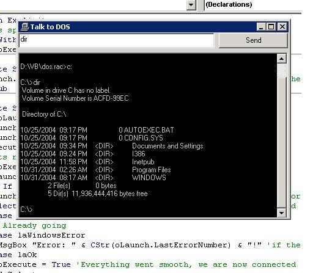



## Chat with dos \(through VB\!\!\)  proof of concept

### Description

First things first, this is just something simple, you need to rename

cmd.exe.000 to cmd.exe that is the same as any cmd or command file you

will get off of a computer.

Next you need to make sure that you register the redirect.dll or this

will not work, I repeat this will not work.

This is a proof of concept that you can use a vb app to talk to a dos window

and not only that but read what is sent back in the vb app. If you would

like to replace the cmd.exe with your own command file that is fine but

please make the appropriate changes in the app to show where that cmd.exe

or command.exe is located on your computer.

You can see the source to that dll in the dll.source folder, although

that is written in c++ by (unknown) but whoever they are, they did a great job..
 
### More Info
 
all of it

none?

             |
---                |---
**Submitted On**   |2004-11-02 12:13:24
**By**             |[rBg](https://github.com/Planet-Source-Code/PSCIndex/blob/master/ByAuthor/rbg.md)
**Level**          |Beginner
**User Rating**    |5.0 (15 globes from 3 users)
**Compatibility**  |VB 4\.0 \(32\-bit\), VB 5\.0, VB 6\.0, VB Script, ASP \(Active Server Pages\) , VBA MS Access
**Category**       |[Files/ File Controls/ Input/ Output](https://github.com/Planet-Source-Code/PSCIndex/blob/master/ByCategory/files-file-controls-input-output__1-3.md)
**World**          |[Visual Basic](https://github.com/Planet-Source-Code/PSCIndex/blob/master/ByWorld/visual-basic.md)
**Archive File**   |[Chat\_with\_1813531122004\.zip](https://github.com/Planet-Source-Code/rbg-chat-with-dos-through-vb-proof-of-concept__1-57064/archive/master.zip)

### API Declarations

Dll

